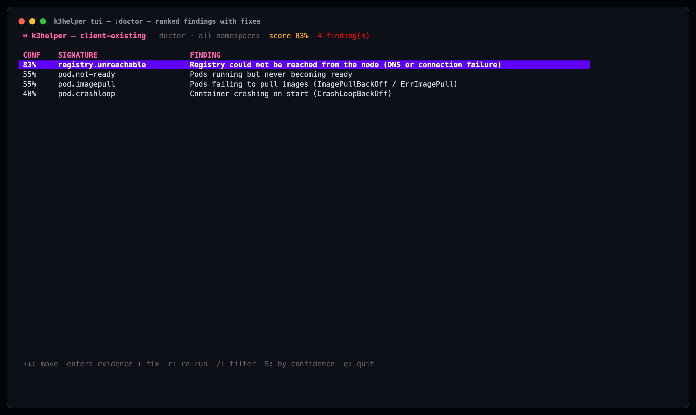
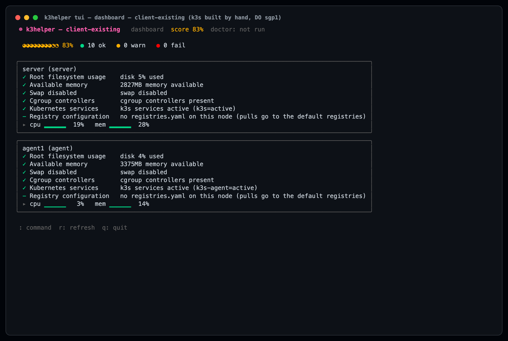
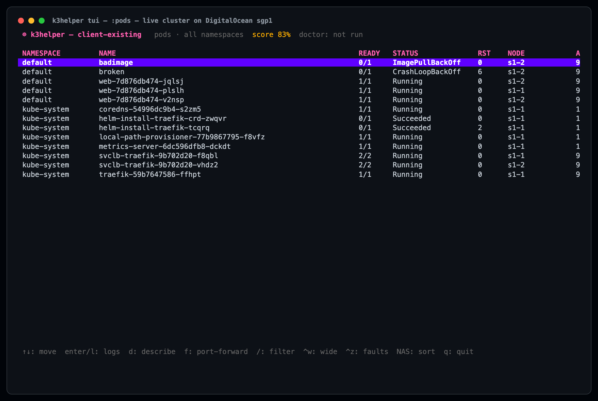
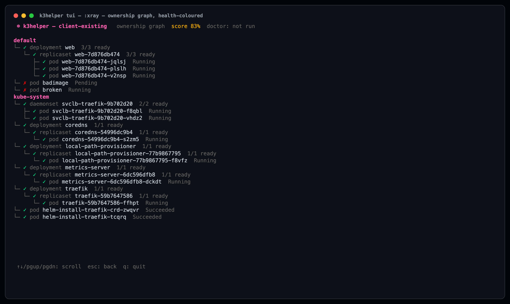
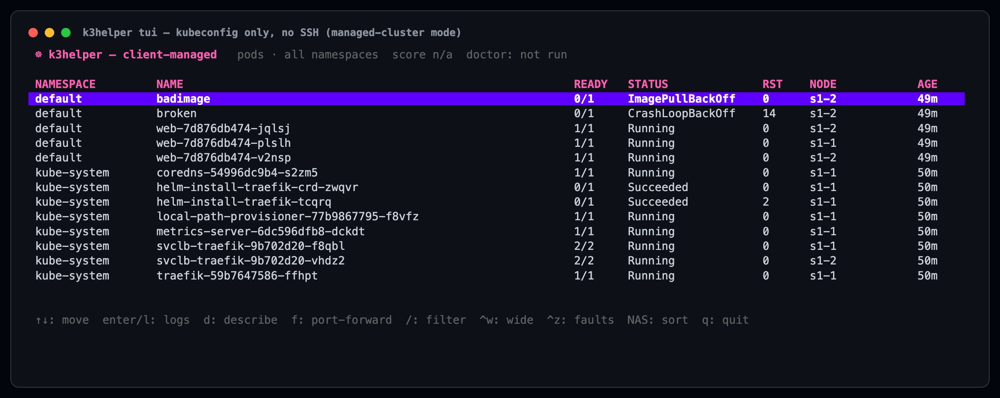
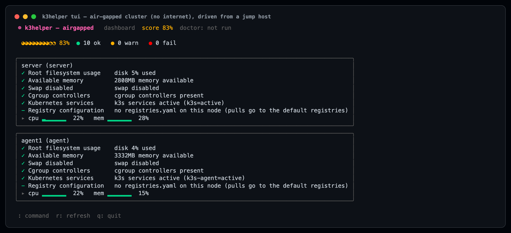
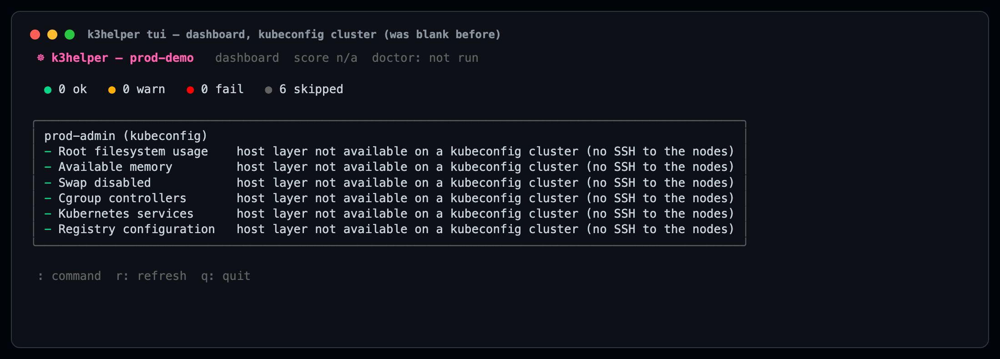

# Live test report — k3helper against real VMs

**Date:** 2026-09-10 · **Provider:** DigitalOcean, `sgp1` (Singapore)
**Nodes:** 7 droplets, Ubuntu 24.04, `s-2vcpu-4gb` (jump host `s-2vcpu-2gb`)
**k3s:** v1.36.4+k3s1 · **Cost:** ~US$0.35 total · **All droplets destroyed at the end**

Three scenarios, each on its own pair of fresh VMs. Every screenshot below is a
real capture of the terminal against the live cluster, not a mockup.

---

## Scenario 1 — a cluster k3helper did not build

**Question:** can we point this at a client's existing Kubernetes?

Two droplets. k3s installed **by hand** with the upstream installer — no
k3helper involved in building anything. Then a workload and two deliberate
faults were deployed, and k3helper was pointed at the result.

```bash
# by hand, as a client would have done it
curl -sfL https://get.k3s.io | INSTALL_K3S_VERSION=v1.36.4+k3s1 sh -
curl -sfL https://get.k3s.io | K3S_URL=... K3S_TOKEN=... sh -    # agent
```

**Result: works, with no adoption step.** `check` detected the distribution per
node from its unit files — `k3s` on the server, `k3s-agent` on the agent —
without being told which was which.

```
== node server (server) ==          == node agent1 (agent) ==
✓  OK    disk 5% used               ✓  OK    disk 4% used
✓  OK    2534MB memory available    ✓  OK    3320MB memory available
✓  OK    swap disabled              ✓  OK    swap disabled
✓  OK    cgroup controllers present ✓  OK    cgroup controllers present
✓  OK    k3s services active        ✓  OK    k3s services active
         (k3s=active)                        (k3s-agent=active)
```

`doctor` found every fault that was planted, and ranked them:



Worth noting what it did *not* do: it separated `registry.unreachable` (83%)
from the generic `pod.imagepull` (55%). The image was `registry.invalid/nope`,
so the pull never got as far as an answer — a different fix from a bad tag or a
missing credential, and it said so.







### The same cluster with no SSH at all

The v0.5.0 kubeconfig work, tested the way a managed cluster actually arrives —
a kubeconfig and nothing else:

```bash
k3helper init --cluster client-managed --kubeconfig ./kubeconfig.yaml
k3helper doctor -t s1-kube.yaml       # exit 2
```

Same four faults found, plus an honest note that the host layer was not looked
at. Nothing was silently skipped.



---

## Scenario 2 — a cluster k3helper builds

Two fresh droplets, then:

```bash
k3helper init --server <ip> --agent <ip> --user root --key ...
k3helper vm setup -t targets.yaml --k3s-version v1.36.4+k3s1
```

**Result: `✓ cluster ready` in 32 seconds**, both nodes Ready. `check` came back
all-green, and `doctor` reported two findings immediately after the install
(Traefik still starting) that cleared on their own within 75 seconds:

```
doctor exit=0
✓ no issues detected — cluster looks healthy
```

No false positives on a healthy cluster it had just built.

**But the first attempt failed**, and that turned out to matter — see finding 1.

---

## Scenario 3 — nodes with no internet

**This needed code that did not exist.** `vm setup` piped `curl https://get.k3s.io`
into a shell, which an air-gapped node cannot do.

Set-up: two droplets with **egress blocked at the DigitalOcean firewall** —
outbound allowed only within the VPC subnet — plus one jump host with internet,
standing in for an engineer's laptop inside the client network. The block is at
the provider's edge, not a rule on the host that an install script could undo.

Proof the nodes were actually cut off, before and after:

```
node 1: github=000 get.k3s.io=000
node 2: github=000 get.k3s.io=000
```

### What was built

```bash
# on the jump host (has internet) — 8.3 seconds
k3helper bundle k3s --version v1.36.4+k3s1 --arch amd64 -o /root/k3s-bundle
  k3s                        75MB   835873f37245
  k3s-airgap-images.tar.zst  184MB  9024613e2d46
  install.sh                 37KB   e5cc3b3d9dfc
✓ bundle ready

# same jump host, reaching the cut-off nodes over the private network
k3helper vm setup -t /root/targets.yaml --bundle /root/k3s-bundle
  [10.104.0.13] uploading k3s-airgap-images.tar.zst (184MB)...
  [INFO] Skipping k3s download and verify        ← never touched the internet
  [10.104.0.13] other nodes will join at https://10.104.0.13:6443
  waiting for 2 node(s) to become ready...
  ✓ cluster ready
```

Every asset is verified against the release's own sha256 manifest before it
goes anywhere.

**Result:**

```
NAME      STATUS   ROLES           AGE   VERSION
s3air-1   Ready    control-plane   30s   v1.36.4+k3s1
s3air-2   Ready    <none>          19s   v1.36.4+k3s1

egress test: github=000 k3s.io=000
```



`doctor` on the air-gapped cluster: `✓ no issues detected`, exit 0.

---

## What live testing found that unit tests could not

### 1. The k3s channel service was down, worldwide

`update.k3s.io` served a **Traefik default certificate from all three of its
IP addresses** — reproducible from DigitalOcean *and* from a laptop in Hong
Kong. Every `curl -sfL https://get.k3s.io | sh -` on the internet was failing
TLS verification, and `vm setup` failed with it:

```
[INFO]  Finding release for channel stable
curl: (60) SSL certificate problem: self-signed certificate
[ERROR]  Download failed
```

Not our bug, but our problem: a tool that installs k3s should not be defeated
by a lookup service it does not control.

**Fixed:** `--k3s-version` pins a release and skips the channel entirely,
fetching from the GitHub release, which stayed healthy throughout.

### 2. Agents joined on the wrong address

The address agents dial to reach the server was discovered with `hostname -I`,
which lists a cloud VM's **public** address first. On the air-gapped nodes that
is the one address the network cannot reach:

```
level=error msg="Failed to validate connection to cluster at
https://165.22.58.110:6443: failed to get CA certs ... context deadline exceeded"
```

The agents retried that forever while the server ran perfectly well beside
them. The targets file had said `10.104.0.13` — the address k3helper itself had
just used to SSH in.

**Fixed:** the join address now comes from the targets file. `--join-address`
covers the case where the two networks genuinely differ (SSH over public, join
over private).

### 3. `%!w(<nil>)` in the failure message

When the install above failed, the last thing on screen was:

```
Error: server install failed (exit 1): %!w(<nil>)
```

A command that ran and exited non-zero has no error to wrap, and `%w` printed
its own failure where the reason should have been.

**Fixed**, with a test that fails if a format verb ever leaks into that message
again.

### 4. A healthy managed cluster scored 0%

Caught in a screenshot, not by a test. Every host check is skipped on a
kubeconfig cluster, and the TUI counted a skip as "not OK" — putting
`score 0%` at the top of a screen showing a perfectly healthy cluster.

**Fixed:** a skip is excluded from both halves of the fraction, so it reads
`score n/a`.

### 5. cloud-init races the installer

A fresh Ubuntu image is still replacing `ca-certificates` when sshd starts
answering, and every https download on the box fails TLS verification while it
does. An install in that window dies with "curl failed to verify the legitimacy
of the server", which reads like a firewall problem and is not one. It bit this
run about 30 seconds after boot.

**Fixed in the product**, not just the test tooling: both install paths now
wait for cloud-init before touching the machine — guarded by a presence check
so a node without cloud-init is not delayed, and bounded at five minutes so a
stuck one cannot hang the install. The kubeadm path needed it more than k3s:
its prerequisites run `apt` straight into cloud-init's dpkg lock.

### 6. Confirmed working, unchanged

- **The crashloop fix from v0.5.0 earned itself.** The pod was caught with its
  container `terminated`, not `waiting: CrashLoopBackOff` — precisely the
  sampling window the old code missed. The restart count caught it.

---

## A second pass: what the audit found after the fixes

Each fault above is an instance of a class, so the codebase was searched for
siblings. Six more, none of which had been exercised live.

**The same join-address bug exists in the kubeadm path.** `kubeadm init`
defaults the API server's advertise address to the default route's interface —
the public one on a cloud VM — and the join command handed to every agent is
built from it. Identical failure, different installer. Fixed the same way, and
the resolver is now shared rather than implemented twice. Found by reading, not
by running: the kubeadm path was never live-tested here.

**The dashboard was blank for a kubeconfig cluster.** It iterated the targets
file's nodes, and a kubeconfig cluster has none — so the skipped host checks
and their reason never reached the screen. An empty dashboard reads as "all
clear", which is the one thing those skipped results exist to prevent. This is
the same bug as the 0% score, one layer up.



*The kubeconfig dashboard after the fix. Before it, this screen was empty.*

**Skipped checks were invisible in the counter**, which read `0 ok, 0 warn,
0 fail` on a cluster where six checks had been deliberately skipped. Now says
`6 skipped`.

**`--bundle` with `--distro kubeadm` was silently ignored.** An operator asking
for an offline install would have got an online one, and found out on an
air-gapped node at the worst possible moment. Now refused with the reason.
`--bundle` with `--k3s-version` is refused too — they contradict.

**The bundle's architecture was recorded but never checked.** The manifest
carries it and a comment claimed it prevented installing an arm64 build on an
amd64 node; nothing compared the two, so the first sign would have been "cannot
execute binary file" after a 260MB upload. Now checked on every node before any
node is uploaded to.

**Uploads were neither verified nor cleaned up.** 260MB over a link that may be
a tunnel, with the hashes already in the manifest and unused. A truncated k3s
binary fails immediately; a truncated image archive fails much later, as pods
that will not start on a cluster that installed cleanly. Now hashed on the node
after upload, and the staging copy is removed once the installer has run rather
than left on every node's disk.

**One of my own:** `installFailure` duplicated `exitReason`, which the kubeadm
path had been using correctly all along. Consolidated.

---

## Reproducing this

```bash
test/do/do.sh up s1 2          # two droplets, sgp1
test/do/do.sh cut s1           # block egress at the provider firewall
test/do/do.sh mend s1          # restore it
test/do/do.sh list             # everything still costing money
test/do/do.sh down s1          # destroy
```

The token is read from a gitignored `.env.production` and never passed on a
command line, where `ps` would show it to any other user on the machine.
Everything created is tagged `k3helper-test`, so `down` cannot touch a droplet
this tool did not create.

## Still open

- **The web GUI is not built.** These are the TUI. `k3helper serve` — the
  browser UI that would also run in Docker — is the next piece.
- **Workload images in an air-gapped cluster.** The bundle covers the cluster's
  own images. Client images still need an internal registry, which k3helper can
  already configure but which this test did not exercise.
- **Bundle fan-out.** Each node is uploaded to directly. Seeding one node and
  having it distribute to the rest would save N× the transfer on a slow link.
